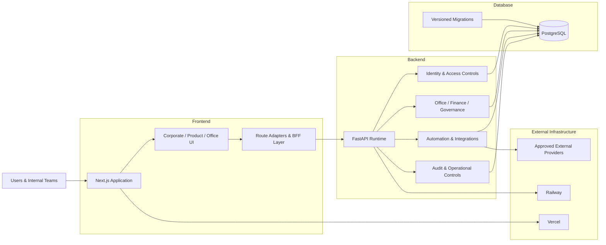

<div align="center">


# KRAVIA PRIVATE LIMITED

### Product engineering · enterprise operations · controlled infrastructure

KRAVIA builds and operates software platforms with a focus on durable architecture, disciplined execution, secure operations, and measurable product quality.

[](https://github.com/vamsimarripudi/kraviaprivatelimited/actions/workflows/ci.yml)


<sub><strong>Canonical branch:</strong> main &nbsp;·&nbsp; <strong>Architecture:</strong> Frontend / Backend / Database &nbsp;·&nbsp; <strong>CI:</strong> enforced quality gates</sub>

</div>

---

## Executive overview

This repository is the primary engineering workspace for the KRAVIA corporate platform and controlled internal operating systems. The codebase is intentionally organized into three explicit application boundaries so browser delivery, business execution, and persistence remain independently understandable and testable.

| Boundary | Responsibility | Primary runtime |
| --- | --- | --- |
| **`Frontend/`** | Corporate web experience, product surfaces, internal workspaces, browser-facing route adapters and UI systems | Next.js 16 · React 19 · TypeScript |
| **`Backend/`** | KRAVIA Office services, finance and ownership controls, operational APIs, identity, automation, audit and deployment assets | Python 3.13 · FastAPI · SQLAlchemy |
| **`Database/`** | Versioned database project configuration and migrations | PostgreSQL · Supabase project assets |

Repository-control files remain at the root only where Git, GitHub Actions, automation agents or repository tooling require them.

---

## System architecture



### Architecture principles

- **Clear boundaries** — presentation, business execution and persistence remain visibly separated.
- **Fail closed** — sensitive or production-only actions do not silently fall back to unsafe behavior.
- **Server-owned data access** — application clients do not receive unrestricted database access.
- **Versioned change** — schema and API evolution are controlled, testable and reviewable.
- **Operational evidence** — important actions are designed around traceability, auditability and explicit state.
- **No warning suppression as strategy** — actionable warnings are fixed at the source rather than hidden.

---

## Platform surfaces

The frontend contains both public-facing and controlled internal application surfaces.

| Surface | Purpose |
| --- | --- |
| **Corporate** | Company information, governance-facing views, documents, support and controlled administration |
| **Office** | Internal operating environment for workforce, requests, approvals, collaboration and company execution |
| **Finance** | Finance, ownership, expense, mandate, funding, accounting and control workflows |
| **Admin** | Restricted administrative control surfaces and operational monitoring |
| **Products** | Product-specific public and platform experiences, including Vidyaluma, Vorio and Yukta surfaces present in this repository |
| **APIs** | Corporate, support, privacy, automation, Office authentication/access and runtime adapters |

The backend remains the authority for protected business behavior. UI availability alone does not grant execution authority.

---

## Repository anatomy

```text
kraviaprivatelimited/
│
├── Frontend/                  # Next.js / React / TypeScript application
│   ├── app/                   # App Router pages, route handlers and layouts
│   ├── components/            # Reusable interface components
│   ├── lib/                   # Domain helpers, server utilities and integrations
│   ├── public/                # Brand and product assets
│   ├── tests/                 # Vitest test suite
│   └── package.json
│
├── Backend/                   # KRAVIA Office + controlled service runtime
│   ├── backend/               # FastAPI application and business domains
│   ├── scripts/               # Quality, contract and operational tooling
│   ├── spec/                  # API, security and deployment specifications
│   ├── web/                   # Controlled backend-served Office assets
│   ├── Dockerfile.api         # Railway production image
│   └── alembic.ini            # Migration runtime configuration
│
├── Database/
│   └── supabase/              # Database project configuration and migrations
│
├── .github/workflows/         # CI quality gates
├── .gitignore
├── AGENTS.md
└── README.md
```

---

## Engineering quality bar

Every change to the canonical codebase is expected to remain green across static analysis, automated tests, production builds and deployment-artifact validation.

### Frontend gate

```bash
cd Frontend
npm ci
npm audit --audit-level=high
npm run lint
npm run typecheck
npm test
npm run build
```

Current frontend stack includes **Next.js 16.3.5**, **React 19.2.8**, **TypeScript 5.9**, **Vitest 4**, Supabase SSR/client libraries, Motion, Recharts, Zod and Vercel Analytics.

### Backend gate

```bash
cd Backend
python -m pip install -r backend/requirements.txt
python -m pip check
python -m compileall -q backend
python scripts/export_openapi.py --check
alembic upgrade head
python -m pytest backend/tests -q
python scripts/quality_gate.py
```

The CI pipeline additionally builds the exact Railway Docker image, verifies the packaged PostgreSQL driver and smoke-tests the container liveness endpoint.

### Database gate

Database project assets and migrations are versioned under:

```text
Database/supabase/
```

Production credentials, service-role keys, database passwords and provider-side secrets are never committed to the repository.

---

## Local development

<details>
<summary><strong>Frontend development</strong></summary>

```bash
cd Frontend
npm ci
npm run dev
```

Before pushing changes:

```bash
npm run lint
npm run typecheck
npm test
npm run build
```

Node.js **22.x** is the declared runtime line for the frontend workspace.

</details>

<details>
<summary><strong>Backend development</strong></summary>

```bash
cd Backend
python -m pip install -r backend/requirements.txt
python -m uvicorn backend.app:app --reload --port 8000
```

Run backend verification with:

```bash
python -m pytest backend/tests -q
python scripts/quality_gate.py
```

Development defaults are intentionally separate from production identity, finance execution and provider configuration.

</details>

<details>
<summary><strong>Database development</strong></summary>

Database migrations and project configuration live under `Database/supabase/`.

Apply database changes only through controlled migration workflows. Never hard-code production connection strings or provider credentials into application source.

</details>

---

## Security posture

Security controls are treated as application behavior, not deployment decoration.

**Current design includes:**

- OIDC/JWKS-based production identity boundaries.
- MFA/AAL controls for protected Office sessions.
- Role and authorization checks at execution time.
- Browser origin and host allowlists.
- Mutation rate limiting and security headers.
- Controlled finance execution modes.
- Audit-oriented workflow history.
- Versioned OpenAPI contract validation.
- Secret scanning in CI.
- Read-only evidence integration boundaries where external data is referenced.

### Secret-handling rule

```text
Source control contains configuration names and safe placeholders only.
Real credentials belong in approved deployment secret stores.
```

If a credential is ever exposed in Git history, rotation is required even if the file is later deleted.

---

## Deployment boundaries

| Layer | Deployment responsibility | Repository contract |
| --- | --- | --- |
| **Frontend** | Vercel-compatible Next.js deployment | Service root: `Frontend/` |
| **Backend** | Railway container deployment | Service root: `Backend/` · Dockerfile: `Dockerfile.api` · liveness: `/health/live` |
| **Database** | Provider-managed PostgreSQL/Supabase environment | Versioned assets under `Database/supabase/` |

Application code, deployment configuration and production credentials are deliberately treated as separate concerns.

---

## Backend operational domains

The KRAVIA Office backend contains controlled domains for company operations rather than a single undifferentiated API layer.

```text
Identity & access
      ↓
Company / governance
      ↓
Finance / ownership / treasury
      ↓
Workforce / approvals / requests
      ↓
Commercial and operational records
      ↓
Evidence / integrations / audit
```

OpenAPI drift checks, migration checks, API tests and domain-specific quality checks are part of the repository quality gate.

---

## CI/CD standard

GitHub Actions is the repository-level acceptance gate.

A successful pipeline verifies:

1. Repository boundaries remain intact.
2. Frontend dependencies install cleanly.
3. High-severity dependency audit passes.
4. Secret scan passes.
5. ESLint passes.
6. TypeScript passes without emit.
7. Frontend automated tests pass.
8. Next.js production build succeeds.
9. Python dependency consistency passes.
10. Python source compiles.
11. OpenAPI contract has no drift.
12. Alembic reaches head on the CI database.
13. Backend test suite passes.
14. Backend quality policy passes.
15. Railway Docker artifact builds.
16. PostgreSQL runtime driver is present in the image.
17. Container liveness smoke test succeeds.

The objective is not merely a green badge. The objective is a reproducible, deployable codebase with a visible engineering standard.

---

## Engineering rules

> **`main` is the canonical repository state.**

- Keep application code inside the correct `Frontend/`, `Backend/` or `Database/` boundary.
- Do not recreate legacy root application folders.
- Do not commit generated secrets, `.env` credentials, private keys or production tokens.
- Do not bypass lint, type or test failures with blanket suppression.
- Do not make production migrations implicitly from unrelated application changes.
- Keep public API contracts and migrations synchronized with implementation.
- Prefer explicit runtime failure over silent unsafe fallback for protected operations.
- Preserve auditability for company, finance and privileged workflows.

---

## Technology profile

<div align="center">

| Web | Service | Data | Quality | Infrastructure |
| :---: | :---: | :---: | :---: | :---: |
| Next.js 16 | FastAPI | PostgreSQL | GitHub Actions | Railway |
| React 19 | Python 3.13 | Supabase assets | Vitest | Vercel-compatible |
| TypeScript 5.9 | SQLAlchemy | Alembic | Pytest | Docker |
| Motion / Recharts | Pydantic | Versioned migrations | ESLint / TSC | Provider secrets |

</div>

---

<div align="center">

### KRAVIA PRIVATE LIMITED

**Engineering systems intended to stay understandable as they scale.**

<sub>Repository architecture · application delivery · operational control · product execution</sub>

</div>
